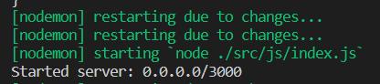
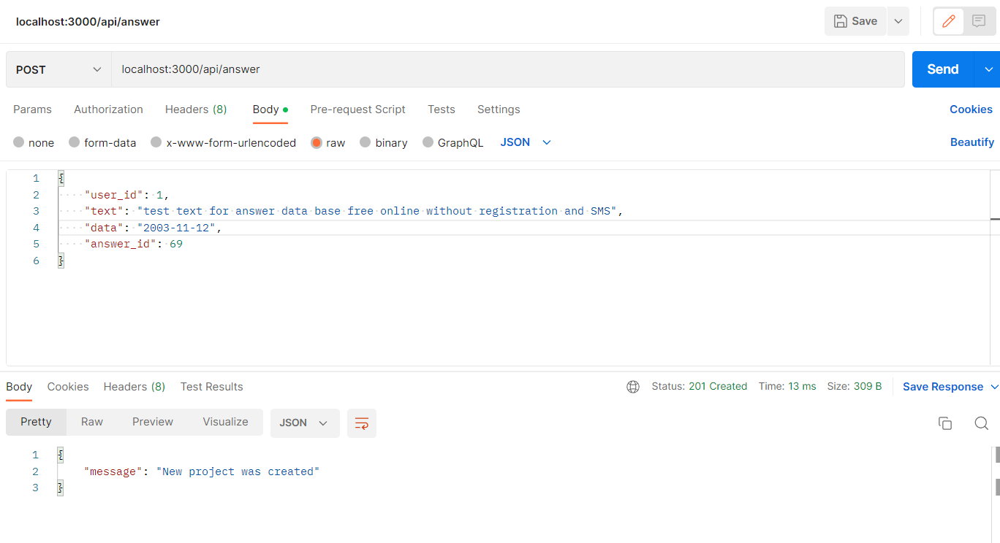
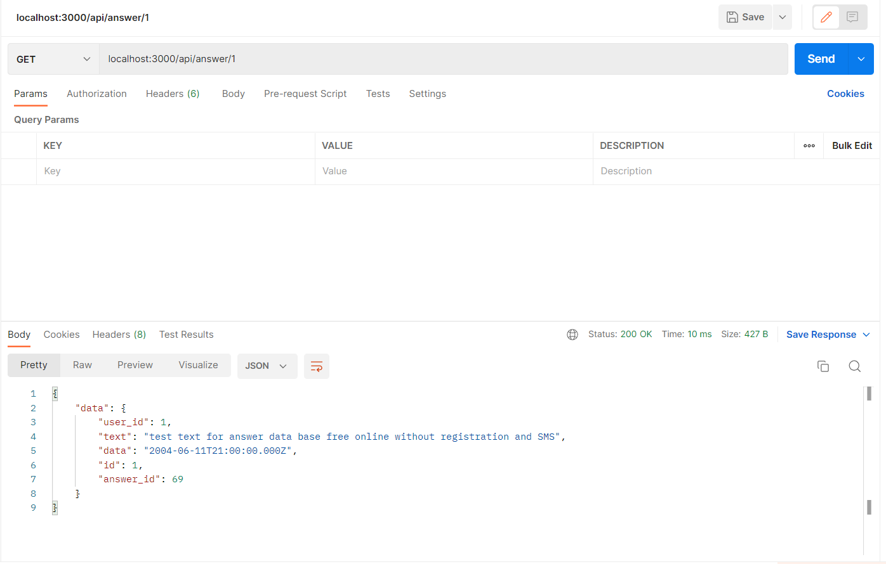
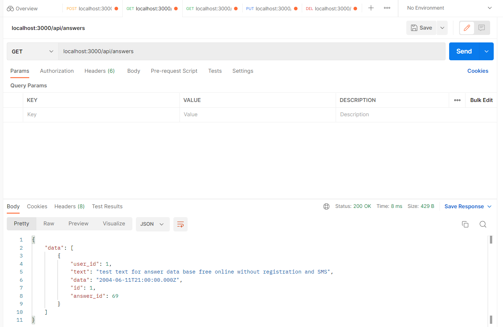
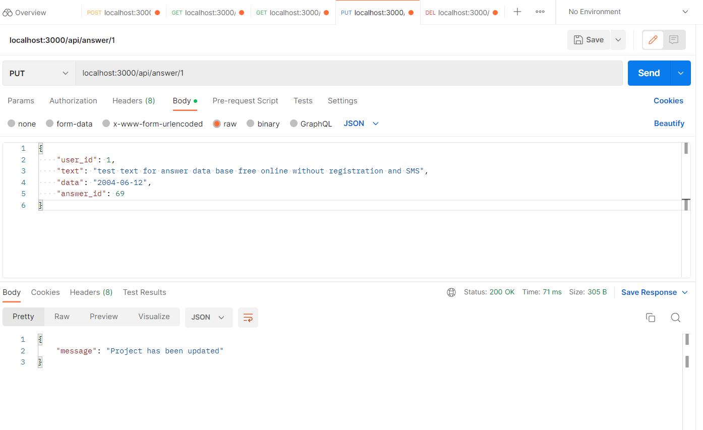
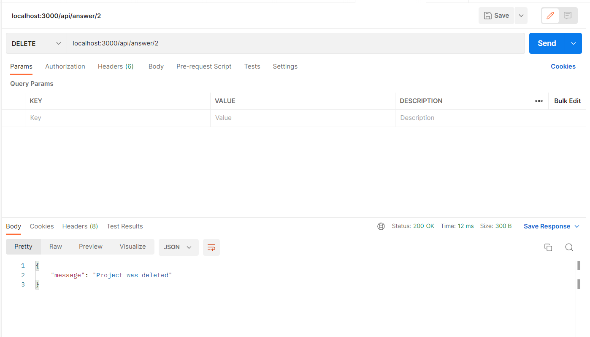

# Тестування працездатності системи

## Термінал сервера

## Запит POST для створення відповіді

## Запит GET на отримання користувача за ідентифікатором

## Запит GET на отримання всіх користувачів

## Запит PUT на оновлення користувача за ідентифікатором

## Запит DELETE на видалення користувача за ідентифікатором

